# Vibe Security MVP


🏆 **[1st Place SDx Replit Vibe Coding 2025 Hackathon](https://x.com/SDxCommunity/status/1914458552397389830)**

🚀 **[Featured on Product Hunt](https://www.producthunt.com/products/vibe-security?embed=true&launch=vibe-security)**

## Overview
A web-based cybersecurity scanning tool that provides comprehensive website security checks. The platform offers a free tier with basic features and a premium one-time purchase option for advanced functionality.

## Core Features

### URL Scanning
- Simple URL input interface
- Comprehensive security checks

### Security Checks
#### Free Tier (10 Checks)
- HTTPS implementation
- SSL certificate validity
- Content Security Policy (CSP)
- X-Frame-Options
- HTTP Strict Transport Security (HSTS)
- Directory listing vulnerabilities
- Server information leakage
- Admin page exposure
- HTTPS form submission
- Referrer policy

#### Premium Tier (20 Checks)
All free tier checks plus:
- CORS configuration
- Cookie security
- Debug mode detection
- Redirect analysis
- Rate limiting
- Additional advanced checks like: 


### Results Dashboard
- **Free Users**: Pass/Fail/Warning indicators for 10 checks
- **Premium Users**: 
  - Detailed results for all 20 checks
  - "Fix Prompt" button for each identified issue
  - PDF/JSON export capability

### User Features
- Firebase Authentication (email/password or Google OAuth)
- Scan History:
  - Free: Up to 5 scans
  - Premium: Unlimited scans
- Premium Fix Prompts: Pre-written LLM prompts for issue resolution

## Pricing Model

### Free Tier
- 10 security checks
- 5 scan history limit
- Basic results dashboard

### Premium Unlock ($10 / month )
- All 20 security checks
- Fix prompts for identified issues
- Unlimited scan history
- Export functionality (PDF/JSON)

### Enterprise License (Contact)
- Multi-user access
- API integration
- Custom branding options

## Getting Started

### Installation
```bash
pip install -r requirements.txt
```

### Go Scanner Setup
The security scanner is implemented in Go for improved performance. To build the scanner:

```bash
# Install Go dependencies and build scanner
go mod tidy
go build -o goscan main.go
```

The `goscan` executable will be automatically used by the Python application.

### Development Commands
```bash
# Run tests
pytest

# Lint code
ruff check .

# Format code
ruff format .

# Run both linting and tests
ruff check . && ruff format . && pytest
```

### Environment Setup
1. Copy `.env.example` to `.env`:
   ```bash
   cp .env.example .env
   ```

2. Configure Firebase credentials in `.env`:
   ```bash
   FIREBASE_API_KEY=your_firebase_api_key
   FIREBASE_AUTH_DOMAIN=your_project.firebaseapp.com
   FIREBASE_PROJECT_ID=your_project_id
   FIREBASE_STORAGE_BUCKET=your_project.firebasestorage.app
   FIREBASE_MESSAGING_SENDER_ID=your_sender_id
   FIREBASE_APP_ID=your_app_id
   FIREBASE_MEASUREMENT_ID=your_measurement_id
   ```

3. Place your Firebase service account JSON file in the project root
   - **Never commit this file to version control!**
   - The file should be named similar to: `projectname-firebase-adminsdk-xxxxx.json`

### Running the Application
```bash
python main.py
```
Application will start on `http://localhost:8000`

## Project Structure

```
├── main.py                 # Application entry point
├── config.py              # Firebase & FastAPI configuration
├── auth.py                # Authentication utilities
├── tasks.py               # Background scheduled tasks
├── scanner.py             # Security scanning wrapper (calls Go executable)
├── main.go                # Go-based security scanner implementation
├── go.mod                 # Go module dependencies
├── goscan                 # Compiled Go scanner executable
├── routes/                # Route modules
│   ├── main.py           # Page routes (/, /dashboard, /blog, /privacy, /terms)
│   ├── api.py            # Core API (scan, contact, verify-token)
│   ├── admin.py          # Admin endpoints (user management)
│   ├── debug.py          # Debug & diagnostics
│   ├── replit.py         # Replit security checks
│   ├── stats.py          # Statistics & analytics
│   └── scans.py          # Scan management (history, scheduling)
├── static/               # Frontend assets
│   ├── css/             # Stylesheets
│   └── js/              # JavaScript modules
├── templates/           # HTML templates
│   ├── index.html       # Main landing page
│   ├── dashboard.html   # User dashboard
│   ├── blog.html        # Security blog
│   ├── stats.html       # Usage statistics
│   ├── privacy.html     # Privacy policy
│   └── terms.html       # Terms of service
└── .env.example         # Environment variables template
```

## Application Architecture

```mermaid
graph LR
    USER[👤 User] --> PAGES[🌐 Web Pages]
    PAGES --> MAIN[🚀 main.py]
    MAIN --> ROUTES[📋 Route Modules]
    
    ROUTES --> API[🔌 API Routes]
    ROUTES --> SCANS[📊 Scan Routes] 
    ROUTES --> STATS[📈 Stats Routes]
    
    API --> SCANNER[🔍 Scanner]
    API --> AUTH[🔐 Auth]
    API --> DB[(💾 Firestore)]
    
    SCANS --> AUTH
    SCANS --> DB
    
    STATS --> DB
    
    MAIN --> TASKS[⏰ Background Tasks]
    TASKS --> SCANNER
    
    SCANNER --> WEB[🌍 Target Sites]

    %% Clean styling
    classDef default fill:#f8fafc,stroke:#64748b,stroke-width:2px,color:#334155
    classDef user fill:#dbeafe,stroke:#3b82f6,stroke-width:2px,color:#1e40af
    classDef app fill:#dcfce7,stroke:#22c55e,stroke-width:2px,color:#15803d
    classDef routes fill:#fef3c7,stroke:#f59e0b,stroke-width:2px,color:#d97706
    classDef services fill:#fce7f3,stroke:#ec4899,stroke-width:2px,color:#be185d
    classDef external fill:#e0f2fe,stroke:#0891b2,stroke-width:2px,color:#0e7490
    
    class USER user
    class PAGES,MAIN app
    class ROUTES,API,SCANS,STATS routes
    class SCANNER,AUTH,TASKS services
    class DB,WEB external
```



## Technical Specifications

### Architecture
- **Modular Design**: Separated concerns with dedicated modules
- **FastAPI**: High-performance async Python web framework
- **Firebase**: Authentication and Firestore database
- **Background Tasks**: Scheduled scanning with asyncio

### Tech Stack
- **Backend**: FastAPI + Firebase (Auth & Firestore)
- **Scanner**: Go (high-performance security scanning)
- **Frontend**: HTML/CSS/JavaScript (modular approach)
- **Styling**: Tailwind CSS + Custom CSS
- **Database**: Firestore (NoSQL document database)
- **Authentication**: Firebase Auth
- **Deployment**: Render + Firebase Hosting

### Key Features
- **Security Scanning**: High-performance Go-based website vulnerability assessment
- **User Authentication**: Firebase-based secure login system
- **Scan History**: Persistent storage and management of scan results
- **Scheduled Scans**: Automated background scanning with configurable intervals
- **Real-time Statistics**: Usage analytics and performance metrics
- **Premium Features**: Advanced scanning and export capabilities

## Contributing

### Security Guidelines
- **Never commit credentials** (API keys, service accounts, etc.)
- Use environment variables for all sensitive configuration
- Test security changes thoroughly before submitting PRs

### Development Setup
1. Fork and clone the repository
2. Follow the environment setup instructions above
3. Create a feature branch: `git checkout -b feature-name`
4. Make your changes and test thoroughly
5. Submit a pull request

### Code Style
- Follow existing code patterns and conventions
- Keep modules focused on single responsibilities
- Add docstrings to new functions and classes
- Test your changes before submitting

